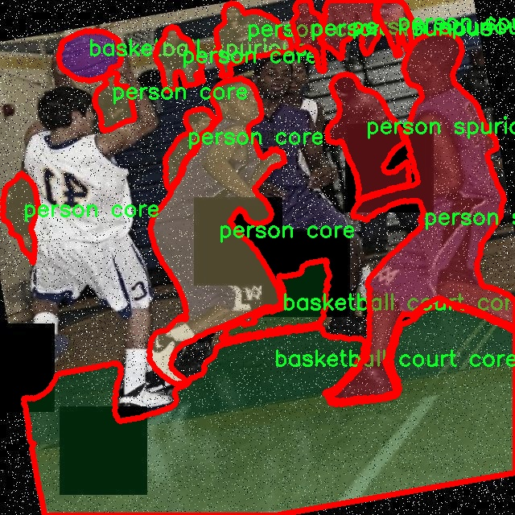

# 日常场景图像分割系统源码＆数据集分享
 [yolov8-seg-LSKNet＆yolov8-seg-LAWDS等50+全套改进创新点发刊_一键训练教程_Web前端展示]

### 1.研究背景与意义

项目参考[ILSVRC ImageNet Large Scale Visual Recognition Challenge](https://gitee.com/YOLOv8_YOLOv11_Segmentation_Studio/projects)

项目来源[AAAI Global Al lnnovation Contest](https://kdocs.cn/l/cszuIiCKVNis)

研究背景与意义

随着计算机视觉技术的迅猛发展，图像分割作为其中一个重要的研究方向，逐渐引起了学术界和工业界的广泛关注。图像分割的目标是将图像分割成多个有意义的区域，以便于后续的分析和处理。在众多的图像分割方法中，基于深度学习的实例分割技术因其优越的性能和广泛的应用前景而备受青睐。YOLO（You Only Look Once）系列模型以其快速、高效的目标检测能力而闻名，而YOLOv8作为该系列的最新版本，凭借其改进的网络结构和算法，展现了更强的特征提取和处理能力。因此，基于改进YOLOv8的日常场景图像分割系统的研究，具有重要的理论价值和实际意义。

在日常生活中，图像分割技术的应用场景极为广泛，包括自动驾驶、智能监控、医疗影像分析等。以自动驾驶为例，车辆需要实时识别和分割道路上的各种物体，如行人、交通标志、其他车辆等，以确保行车安全。而在智能监控中，图像分割可以帮助系统更准确地识别和跟踪可疑行为，提升安全防范能力。因此，构建一个高效、准确的图像分割系统，能够为这些应用提供强有力的技术支持。

本研究所使用的数据集“combined_core_spur”包含8800幅图像，涵盖42个类别，包括飞机、篮球、汽车、行人等多个日常场景中的目标。这些类别不仅丰富多样，而且具有较高的实际应用价值，能够有效地模拟现实世界中的复杂场景。通过对这些图像进行实例分割，可以深入分析不同物体之间的关系和相互作用，从而为更高层次的理解和决策提供依据。此外，数据集中“core”和“spurious”两类目标的设置，使得模型在训练过程中能够更好地学习到目标的特征和背景信息，从而提升分割的准确性和鲁棒性。

在技术层面，改进YOLOv8模型的引入，为图像分割任务提供了新的思路。通过对YOLOv8的网络结构进行优化，结合实例分割的需求，可以有效提升模型在复杂场景下的表现。改进的网络结构不仅能够提高特征提取的效率，还能增强模型对小目标和复杂背景的适应能力。这一研究不仅推动了图像分割技术的发展，也为相关领域的应用提供了新的解决方案。

综上所述，基于改进YOLOv8的日常场景图像分割系统的研究，不仅具有重要的理论意义，也为实际应用提供了切实可行的技术支持。通过对日常场景的深入分析和实例分割的实现，能够推动计算机视觉技术的进一步发展，助力各类智能应用的落地与推广。

### 2.图片演示


##### 注意：由于此博客编辑较早，上面“2.图片演示”和“3.视频演示”展示的系统图片或者视频可能为老版本，新版本在老版本的基础上升级如下：（实际效果以升级的新版本为准）

  （1）适配了YOLOV8的“目标检测”模型和“实例分割”模型，通过加载相应的权重（.pt）文件即可自适应加载模型。

  （2）支持“图片识别”、“视频识别”、“摄像头实时识别”三种识别模式。

  （3）支持“图片识别”、“视频识别”、“摄像头实时识别”三种识别结果保存导出，解决手动导出（容易卡顿出现爆内存）存在的问题，识别完自动保存结果并导出到tempDir中。

  （4）支持Web前端系统中的标题、背景图等自定义修改，后面提供修改教程。

  另外本项目提供训练的数据集和训练教程,暂不提供权重文件（best.pt）,需要您按照教程进行训练后实现图片演示和Web前端界面演示的效果。

### 3.视频演示

[3.1 视频演示](https://www.bilibili.com/video/BV1dd1kYeEUW/)

### 4.数据集信息展示

##### 4.1 本项目数据集详细数据（类别数＆类别名）

nc: 42
names: ['airplane core', 'airplane spurious', 'basketball core', 'basketball court core', 'basketball court spurious', 'basketball hoop core', 'basketball hoop spurious', 'basketball spurious', 'bicycle core', 'bicycle spurious', 'bus core', 'bus spurious', 'car core', 'car spurious', 'crosswalk core', 'crosswalk spurious', 'dog core', 'dog spurious', 'fighter jet core', 'fighter jet spurious', 'fire hydrant core', 'fire hydrant spurious', 'helicopter core', 'helicopter spurious', 'landing deck core', 'landing deck spurious', 'motorcycle core', 'motorcycle spurious', 'parking meter core', 'parking meter spurious', 'person core', 'person spurious', 'ship core', 'ship spurious', 'stop sign core', 'stop sign spurious', 'street sign core', 'street sign spurious', 'traffic light core', 'traffic light spurious', 'truck core', 'truck spurious']


##### 4.2 本项目数据集信息介绍

数据集信息展示

在本研究中，我们采用了名为“combined_core_spur”的数据集，以训练和改进YOLOv8-seg模型，旨在实现日常场景图像的高效分割。该数据集包含42个类别，涵盖了多种日常生活中常见的物体和场景元素，为模型的训练提供了丰富的样本和多样化的背景。这些类别的设计不仅考虑了物体的核心特征，还引入了“spurious”类别，以增强模型对复杂场景的适应能力和鲁棒性。

具体而言，数据集中包括了如“airplane core”和“airplane spurious”这样的类别，分别代表了飞机的核心部分和其在特定背景下可能出现的伪影。类似地，篮球场景被细分为“basketball court core”和“basketball court spurious”，这使得模型能够更好地理解和分辨篮球场的主要特征与潜在的干扰信息。此外，数据集中还包含了“bicycle core”和“bicycle spurious”等类别，涵盖了自行车在不同环境下的表现，进一步增强了模型在处理交通场景时的能力。

在交通工具方面，数据集提供了丰富的类别，如“bus core”、“car core”、“truck core”等，这些类别的设置不仅反映了不同类型车辆的核心特征，还包括了对应的伪影类别，如“bus spurious”和“car spurious”，以帮助模型学习在复杂背景下的物体识别和分割。通过这种方式，模型能够在实际应用中更好地应对多变的环境和不同的视觉干扰。

此外，数据集中还涵盖了人类和动物的相关类别，如“person core”和“dog core”，以及它们的伪影版本。这些类别的引入，不仅丰富了数据集的多样性，也为模型在处理人类活动和动物行为时提供了重要的训练数据。通过对这些类别的细致划分，模型能够更准确地识别和分割出人类和动物在日常场景中的位置和活动。

数据集中的标志性元素，如“stop sign core”和“traffic light core”，也为交通场景的分析提供了必要的支持。这些元素的核心与伪影分类，使得模型在面对复杂的交通环境时，能够有效地识别和分割出重要的交通标志，进而提高智能交通系统的安全性和效率。

综上所述，“combined_core_spur”数据集以其丰富的类别和多样化的样本，为YOLOv8-seg模型的训练提供了坚实的基础。通过对核心和伪影类别的细致划分，模型能够在复杂的日常场景中实现更高效的图像分割，推动计算机视觉技术在实际应用中的发展。数据集的设计不仅考虑了物体的基本特征，还兼顾了环境的复杂性，为未来的研究和应用提供了广阔的前景。




### 5.全套项目环境部署视频教程（零基础手把手教学）

[5.1 环境部署教程链接（零基础手把手教学）](https://www.bilibili.com/video/BV1jG4Ve4E9t/?vd_source=bc9aec86d164b67a7004b996143742dc)


[5.2 安装Python虚拟环境创建和依赖库安装视频教程链接（零基础手把手教学）](https://www.bilibili.com/video/BV1nA4VeYEze/?vd_source=bc9aec86d164b67a7004b996143742dc)

### 6.手把手YOLOV8-seg训练视频教程（零基础小白有手就能学会）

[6.1 手把手YOLOV8-seg训练视频教程（零基础小白有手就能学会）](https://www.bilibili.com/video/BV1cA4VeYETe/?vd_source=bc9aec86d164b67a7004b996143742dc)


按照上面的训练视频教程链接加载项目提供的数据集，运行train.py即可开始训练



     Epoch   gpu_mem       box       obj       cls    labels  img_size
     1/200     0G   0.01576   0.01955  0.007536        22      1280: 100%|██████████| 849/849 [14:42<00:00,  1.04s/it]
               Class     Images     Labels          P          R     mAP@.5 mAP@.5:.95: 100%|██████████| 213/213 [01:14<00:00,  2.87it/s]
                 all       3395      17314      0.994      0.957      0.0957      0.0843

     Epoch   gpu_mem       box       obj       cls    labels  img_size
     2/200     0G   0.01578   0.01923  0.007006        22      1280: 100%|██████████| 849/849 [14:44<00:00,  1.04s/it]
               Class     Images     Labels          P          R     mAP@.5 mAP@.5:.95: 100%|██████████| 213/213 [01:12<00:00,  2.95it/s]
                 all       3395      17314      0.996      0.956      0.0957      0.0845

     Epoch   gpu_mem       box       obj       cls    labels  img_size
     3/200     0G   0.01561    0.0191  0.006895        27      1280: 100%|██████████| 849/849 [10:56<00:00,  1.29it/s]
               Class     Images     Labels          P          R     mAP@.5 mAP@.5:.95: 100%|███████   | 187/213 [00:52<00:00,  4.04it/s]
                 all       3395      17314      0.996      0.957      0.0957      0.0845


### 7.50+种全套YOLOV8-seg创新点代码加载调参视频教程（一键加载写好的改进模型的配置文件）

[7.1 50+种全套YOLOV8-seg创新点代码加载调参视频教程（一键加载写好的改进模型的配置文件）](https://www.bilibili.com/video/BV1Hw4VePEXv/?vd_source=bc9aec86d164b67a7004b996143742dc)

### 8.YOLOV8-seg图像分割算法原理

原始YOLOv8-seg算法原理

YOLOv8-seg算法是YOLO系列的最新发展，承载着更高的检测精度和速度，尤其在目标分割任务中展现出其独特的优势。作为YOLOv8的一个变种，YOLOv8-seg不仅继承了YOLOv8的高效架构，还在此基础上增加了分割功能，使其能够在物体检测的同时进行像素级的分割。这一特性使得YOLOv8-seg在许多应用场景中具有更广泛的适用性，如自动驾驶、视频监控、医学影像分析等。

YOLOv8-seg的网络结构同样分为四个主要部分：输入端、骨干网络、颈部网络和头部网络。输入端通过马赛克数据增强、自适应锚框计算和自适应灰度填充等技术对输入图像进行预处理，以提升模型的鲁棒性和准确性。马赛克增强能够有效地扩展训练样本的多样性，而自适应锚框计算则通过动态调整锚框的大小和形状，使得模型能够更好地适应不同尺寸和形状的目标。

在骨干网络部分，YOLOv8-seg采用了C2f模块和SPPF结构。C2f模块通过引入更多的分支和跨层连接，增强了梯度流动，提升了特征表示能力。这种设计使得网络在处理复杂特征时能够更为高效，尤其是在处理细节丰富的图像时，C2f模块能够更好地捕捉到重要的特征信息。SPPF结构则通过空间金字塔池化的方式，有效地融合了不同尺度的特征，为后续的目标分割提供了更为丰富的上下文信息。

颈部网络采用了路径聚合网络（PAN）结构，旨在增强不同尺度特征的融合能力。PAN通过上下采样和特征拼接的方式，将来自不同层次的特征进行有效整合，从而使得模型在处理多尺度目标时表现出色。这一设计不仅提高了特征的表达能力，还增强了模型对小目标的感知能力，解决了传统目标检测模型在小目标检测中的不足。

在头部网络方面，YOLOv8-seg采用了解耦头结构，将分类和分割任务分开处理。这一设计使得模型在进行目标检测和分割时，能够更为专注于各自的任务，避免了耦合结构中可能出现的性能瓶颈。具体而言，分类分支负责提取类别特征，而分割分支则专注于像素级的特征提取。通过这种解耦的方式，YOLOv8-seg能够在保证检测精度的同时，提升分割的准确性。

YOLOv8-seg在标签分配策略上也进行了创新，采用了动态标签分配策略，避免了传统方法中可能出现的样本不均衡问题。该策略根据目标的类别得分和位置得分进行加权，从而实现更为合理的正负样本匹配。这一设计不仅提高了模型的训练效率，还增强了其对复杂场景的适应能力。

在损失计算方面，YOLOv8-seg结合了多种损失函数，以提升模型的整体性能。分类损失采用了二元交叉熵损失，而回归损失则结合了分布焦点损失和完全交并比损失。这种多损失函数的设计，使得模型在训练过程中能够更好地平衡分类和回归任务的优化，从而提升了整体的检测和分割性能。

YOLOv8-seg的优势不仅体现在其高效的网络结构和先进的损失计算策略上，还在于其出色的实时性能。通过对模型结构的精简和优化，YOLOv8-seg能够在保持高精度的同时，实现快速的推理速度。这一特性使得YOLOv8-seg在实时应用场景中具有显著的竞争优势，能够满足自动驾驶、安防监控等对实时性要求极高的任务需求。

综上所述，YOLOv8-seg算法在YOLO系列的基础上，通过引入先进的网络结构、优化的标签分配策略和多样的损失计算方法，成功实现了目标检测与分割的有效结合。其在多种应用场景中的出色表现，预示着YOLOv8-seg将成为未来计算机视觉领域的重要工具，为相关研究和应用提供更为强大的支持。随着技术的不断进步，YOLOv8-seg的潜力和应用前景将更加广阔，推动着计算机视觉技术的不断发展与创新。


### 9.系统功能展示（检测对象为举例，实际内容以本项目数据集为准）

图9.1.系统支持检测结果表格显示

  图9.2.系统支持置信度和IOU阈值手动调节

  图9.3.系统支持自定义加载权重文件best.pt(需要你通过步骤5中训练获得)

  图9.4.系统支持摄像头实时识别

  图9.5.系统支持图片识别

  图9.6.系统支持视频识别

  图9.7.系统支持识别结果文件自动保存

  图9.8.系统支持Excel导出检测结果数据


### 10.50+种全套YOLOV8-seg创新点原理讲解（非科班也可以轻松写刊发刊，V11版本正在科研待更新）

#### 10.1 由于篇幅限制，每个创新点的具体原理讲解就不一一展开，具体见下列网址中的创新点对应子项目的技术原理博客网址【Blog】：


[10.1 50+种全套YOLOV8-seg创新点原理讲解链接](https://gitee.com/qunmasj/good)

#### 10.2 部分改进模块原理讲解(完整的改进原理见上图和技术博客链接)【此小节的图要是加载失败请移步原始博客查看，链接：https://blog.csdn.net/cheng2333333?type=blog】

### Gold-YOLO简介
YOLO再升级：华为诺亚提出Gold-YOLO，聚集-分发机制打造新SOTA
在过去的几年中，YOLO系列模型已经成为实时目标检测领域的领先方法。许多研究通过修改架构、增加数据和设计新的损失函数，将基线推向了更高的水平。然而以前的模型仍然存在信息融合问题，尽管特征金字塔网络（FPN）和路径聚合网络（PANet）已经在一定程度上缓解了这个问题。因此，本研究提出了一种先进的聚集和分发机制（GD机制），该机制通过卷积和自注意力操作实现。这种新设计的模型被称为Gold-YOLO，它提升了多尺度特征融合能力，在所有模型尺度上实现了延迟和准确性的理想平衡。此外，本文首次在YOLO系列中实现了MAE风格的预训练，使得YOLO系列模型能够从无监督预训练中受益。Gold-YOLO-N在COCO val2017数据集上实现了出色的39.9% AP，并在T4 GPU上实现了1030 FPS，超过了之前的SOTA模型YOLOv6-3.0-N，其FPS相似，但性能提升了2.4%。


#### Gold-YOLO


YOLO系列的中间层结构采用了传统的FPN结构，其中包含多个分支用于多尺度特征融合。然而，它只充分融合来自相邻级别的特征，对于其他层次的信息只能间接地进行“递归”获取。

传统的FPN结构在信息传输过程中存在丢失大量信息的问题。这是因为层之间的信息交互仅限于中间层选择的信息，未被选择的信息在传输过程中被丢弃。这种情况导致某个Level的信息只能充分辅助相邻层，而对其他全局层的帮助较弱。因此，整体上信息融合的有效性可能受到限制。
为了避免在传输过程中丢失信息，本文采用了一种新颖的“聚集和分发”机制（GD），放弃了原始的递归方法。该机制使用一个统一的模块来收集和融合所有Level的信息，并将其分发到不同的Level。通过这种方式，作者不仅避免了传统FPN结构固有的信息丢失问题，还增强了中间层的部分信息融合能力，而且并没有显著增加延迟。


# 8.低阶聚合和分发分支 Low-stage gather-and-distribute branch
从主干网络中选择输出的B2、B3、B4、B5特征进行融合，以获取保留小目标信息的高分辨率特征。


低阶特征对齐模块 (Low-stage feature alignment module)： 在低阶特征对齐模块（Low-FAM）中，采用平均池化（AvgPool）操作对输入特征进行下采样，以实现统一的大小。通过将特征调整为组中最小的特征大小（ R B 4 = 1 / 4 R ） （R_{B4} = 1/4R）（R 
B4 =1/4R），我们得到对齐后的特征F a l i g n F_{align}F align 。低阶特征对齐技术确保了信息的高效聚合，同时通过变换器模块来最小化后续处理的计算复杂性。其中选择 R B 4 R_{B4}R B4 作为特征对齐的目标大小主要基于保留更多的低层信息的同时不会带来较大的计算延迟。
低阶信息融合模块(Low-stage information fusion module)： 低阶信息融合模块（Low-IFM）设计包括多层重新参数化卷积块（RepBlock）和分裂操作。具体而言，RepBlock以F a l i g n ( c h a n n e l = s u m ( C B 2 ， C B 3 ， C B 4 ， C B 5 ) ) F_{align} (channel= sum(C_{B2}，C_{B3}，C_{B4}，C_{B5}))F align (channel=sum(C B2 ，C B3 ，C B4 ，C B5 )作为输入，并生成F f u s e ( c h a n n e l = C B 4 + C B 5 ) F_{fuse} (channel= C_{B4} + C_{B5})F fuse (channel=C B4 +C B5 )。其中中间通道是一个可调整的值（例如256），以适应不同的模型大小。由RepBlock生成的特征随后在通道维度上分裂为F i n j P 3 Finj_P3Finj P 3和F i n j P 4 Finj_P4Finj P 4，然后与不同级别的特征进行融合。


# 8.高阶聚合和分发分支 High-stage gather-and-distribute branch
高级全局特征对齐模块（High-GD）将由低级全局特征对齐模块（Low-GD）生成的特征{P3, P4, P5}进行融合。


高级特征对齐模块(High-stage feature alignment module)： High-FAM由avgpool组成，用于将输入特征的维度减小到统一的尺寸。具体而言，当输入特征的尺寸为{R P 3 R_{P3}R P3 , R P 4 R_{P4}R P4 , R P 5 R_{P 5}R P5 }时，avgpool将特征尺寸减小到该特征组中最小的尺寸（R P 5 R_{P5}R P5  = 1/8R）。由于transformer模块提取了高层次的信息，池化操作有助于信息聚合，同时降低了transformer模块后续步骤的计算需求。

Transformer融合模块由多个堆叠的transformer组成，transformer块的数量为L。每个transformer块包括一个多头注意力块、一个前馈网络（FFN）和残差连接。采用与LeViT相同的设置来配置多头注意力块，使用16个通道作为键K和查询Q的头维度，32个通道作为值V的头维度。为了加速推理过程，将层归一化操作替换为批归一化，并将所有的GELU激活函数替换为ReLU。为了增强变换器块的局部连接，在两个1x1卷积层之间添加了一个深度卷积层。同时，将FFN的扩展因子设置为2，以在速度和计算成本之间取得平衡。

信息注入模块(Information injection module)： 高级全局特征对齐模块（High-GD）中的信息注入模块与低级全局特征对齐模块（Low-GD）中的相同。在高级阶段，局部特征（Flocal）等于Pi，因此公式如下所示：


### 增强的跨层信息流动 Enhanced cross-layer information flow
为了进一步提升性能，从YOLOv8 中的PAFPN模块中得到启发，引入了Inject-LAF模块。该模块是注入模块的增强版，包括了一个轻量级相邻层融合（LAF）模块，该模块被添加到注入模块的输入位置。为了在速度和准确性之间取得平衡，设计了两个LAF模型：LAF低级模型和LAF高级模型，分别用于低级注入（合并相邻两层的特征）和高级注入（合并相邻一层的特征）。它们的结构如图5(b)所示。为了确保来自不同层级的特征图与目标大小对齐，在实现中的两个LAF模型仅使用了三个操作符：双线性插值（上采样过小的特征）、平均池化（下采样过大的特征）和1x1卷积（调整与目标通道不同的特征）。模型中的LAF模块与信息注入模块的结合有效地平衡了准确性和速度之间的关系。通过使用简化的操作，能够增加不同层级之间的信息流路径数量，从而提高性能而不显著增加延迟。


### 11.项目核心源码讲解（再也不用担心看不懂代码逻辑）

#### 11.1 ultralytics\nn\extra_modules\orepa.py

以下是经过简化和注释的核心代码部分，主要保留了 `OREPA` 类及其相关功能。为了便于理解，我将对每个重要部分进行详细的中文注释。

```python
import torch
import torch.nn as nn
import torch.nn.init as init
import torch.nn.functional as F
import numpy as np

# 定义一个函数用于将卷积核和批归一化层的参数融合
def transI_fusebn(kernel, bn):
    gamma = bn.weight  # 获取批归一化的缩放因子
    std = (bn.running_var + bn.eps).sqrt()  # 计算标准差
    # 返回融合后的卷积核和偏置
    return kernel * ((gamma / std).reshape(-1, 1, 1, 1)), bn.bias - bn.running_mean * gamma / std

# 定义OREPA类
class OREPA(nn.Module):
    def __init__(self, in_channels, out_channels, kernel_size=3, stride=1, padding=None, groups=1, dilation=1, act=True):
        super(OREPA, self).__init__()
        self.nonlinear = nn.ReLU() if act else nn.Identity()  # 选择激活函数
        self.kernel_size = kernel_size
        self.in_channels = in_channels
        self.out_channels = out_channels
        self.groups = groups
        self.stride = stride
        self.padding = padding if padding is not None else (kernel_size // 2)  # 自动计算填充

        # 定义卷积层的权重参数
        self.weight_orepa_origin = nn.Parameter(torch.Tensor(out_channels, in_channels // groups, kernel_size, kernel_size))
        init.kaiming_uniform_(self.weight_orepa_origin)  # 权重初始化

        # 定义其他卷积层的权重参数
        self.weight_orepa_avg_conv = nn.Parameter(torch.Tensor(out_channels, in_channels // groups, 1, 1))
        init.kaiming_uniform_(self.weight_orepa_avg_conv)

        self.weight_orepa_1x1 = nn.Parameter(torch.Tensor(out_channels, in_channels // groups, 1, 1))
        init.kaiming_uniform_(self.weight_orepa_1x1)

        # 初始化向量，用于加权不同分支的输出
        self.vector = nn.Parameter(torch.Tensor(3, out_channels))
        init.constant_(self.vector[0, :], 1.0)  # origin
        init.constant_(self.vector[1, :], 0.0)  # avg
        init.constant_(self.vector[2, :], 0.0)  # 1x1

    # 权重生成函数
    def weight_gen(self):
        # 生成不同分支的权重
        weight_orepa_origin = self.weight_orepa_origin * self.vector[0, :].reshape(-1, 1, 1, 1)
        weight_orepa_avg = self.weight_orepa_avg_conv * self.vector[1, :].reshape(-1, 1, 1, 1)
        weight_orepa_1x1 = self.weight_orepa_1x1 * self.vector[2, :].reshape(-1, 1, 1, 1)

        # 合并所有权重
        weight = weight_orepa_origin + weight_orepa_avg + weight_orepa_1x1
        return weight

    # 前向传播函数
    def forward(self, inputs):
        weight = self.weight_gen()  # 生成权重
        out = F.conv2d(inputs, weight, stride=self.stride, padding=self.padding, groups=self.groups)  # 进行卷积操作
        return self.nonlinear(out)  # 应用激活函数

    # 获取等效的卷积核和偏置
    def get_equivalent_kernel_bias(self):
        return transI_fusebn(self.weight_gen(), self.bn)

# 其他类和功能可以根据需要进行类似的处理
```

### 主要改动和注释说明：
1. **模块导入**：保留了必要的模块导入，去掉了不必要的部分。
2. **`transI_fusebn` 函数**：用于融合卷积核和批归一化的参数，简化了注释。
3. **`OREPA` 类**：
   - 构造函数中定义了输入输出通道、卷积核大小、步幅、填充、分组等参数，并初始化卷积层的权重。
   - `weight_gen` 方法用于生成最终的卷积权重，结合了不同分支的权重。
   - `forward` 方法实现了前向传播，进行卷积操作并应用激活函数。
   - `get_equivalent_kernel_bias` 方法用于获取等效的卷积核和偏置。

这种结构保留了核心功能，同时通过注释帮助理解代码的每个部分。其他类可以按照类似的方式进行简化和注释。

这个文件包含了一个名为OREPA的深度学习模块，主要用于构建卷积神经网络中的卷积层。OREPA是“重参数化卷积”的一种实现，旨在通过重参数化来提高模型的效率和灵活性。文件中定义了多个类，包括OREPA、OREPA_LargeConv、ConvBN、OREPA_3x3_RepVGG和RepVGGBlock_OREPA等，每个类都具有特定的功能。

在OREPA类中，构造函数初始化了输入和输出通道、卷积核大小、步幅、填充、分组等参数。根据是否在部署模式下，类会选择不同的初始化方式。如果不是部署模式，类会创建多个可学习的权重参数，包括原始卷积权重、平均卷积权重、1x1卷积权重等，并通过Kaiming均匀分布进行初始化。此外，类还定义了一个fre_init方法，用于初始化先验权重。

weight_gen方法负责生成最终的卷积权重，它通过对不同的权重进行加权求和来实现。forward方法则定义了前向传播过程，执行卷积操作并应用非线性激活函数。

OREPA_LargeConv类用于处理较大的卷积核，构造函数中会创建多个OREPA模块，并通过weight_gen方法生成最终的卷积权重。ConvBN类则是一个简单的卷积层加批归一化的组合，提供了在部署模式下的权重融合功能。

OREPA_3x3_RepVGG类实现了一个3x3卷积的重参数化结构，支持多种通道和分组设置。RepVGGBlock_OREPA类则是一个更复杂的模块，结合了多个卷积层和非线性激活，支持可选的SE注意力机制。

文件中还定义了一些辅助函数，如transI_fusebn和transVI_multiscale，用于在不同的上下文中处理卷积权重和偏置的转换。这些函数的作用是将批归一化层的参数与卷积层的权重进行融合，以便在推理时减少计算量。

总的来说，这个文件提供了一种灵活的方式来构建和优化卷积神经网络中的卷积层，支持多种配置和参数化选项，以适应不同的任务需求。

#### 11.2 ultralytics\models\sam\modules\encoders.py

以下是代码中最核心的部分，并附上详细的中文注释：

```python
import torch
import torch.nn as nn
import torch.nn.functional as F

class ImageEncoderViT(nn.Module):
    """
    使用视觉变换器（ViT）架构的图像编码器，将图像编码为紧凑的潜在空间。
    编码器将图像分割为多个补丁，并通过一系列变换块处理这些补丁。
    最终的编码表示通过一个颈部模块生成。
    """

    def __init__(self, img_size: int = 1024, patch_size: int = 16, in_chans: int = 3, embed_dim: int = 768, depth: int = 12, out_chans: int = 256):
        """
        初始化图像编码器的参数。

        Args:
            img_size (int): 输入图像的大小（假设为正方形）。
            patch_size (int): 每个补丁的大小。
            in_chans (int): 输入图像的通道数。
            embed_dim (int): 补丁嵌入的维度。
            depth (int): ViT的深度（变换块的数量）。
            out_chans (int): 输出通道数。
        """
        super().__init__()
        self.img_size = img_size

        # 补丁嵌入模块，将图像分割为补丁并进行嵌入
        self.patch_embed = PatchEmbed(
            kernel_size=(patch_size, patch_size),
            stride=(patch_size, patch_size),
            in_chans=in_chans,
            embed_dim=embed_dim,
        )

        # 变换块列表
        self.blocks = nn.ModuleList()
        for _ in range(depth):
            block = Block(dim=embed_dim)
            self.blocks.append(block)

        # 颈部模块，用于进一步处理输出
        self.neck = nn.Sequential(
            nn.Conv2d(embed_dim, out_chans, kernel_size=1, bias=False),
            nn.LayerNorm(out_chans),
            nn.Conv2d(out_chans, out_chans, kernel_size=3, padding=1, bias=False),
            nn.LayerNorm(out_chans),
        )

    def forward(self, x: torch.Tensor) -> torch.Tensor:
        """处理输入，通过补丁嵌入、变换块和颈部模块生成输出。"""
        x = self.patch_embed(x)  # 将输入图像转换为补丁嵌入
        for blk in self.blocks:  # 通过每个变换块处理嵌入
            x = blk(x)
        return self.neck(x.permute(0, 3, 1, 2))  # 调整维度并通过颈部模块输出


class Block(nn.Module):
    """变换块，包含多头注意力和前馈网络。"""

    def __init__(self, dim: int):
        """
        初始化变换块的参数。

        Args:
            dim (int): 输入通道数。
        """
        super().__init__()
        self.norm1 = nn.LayerNorm(dim)  # 归一化层
        self.attn = Attention(dim)  # 注意力机制
        self.norm2 = nn.LayerNorm(dim)  # 归一化层
        self.mlp = MLPBlock(embedding_dim=dim)  # 前馈网络

    def forward(self, x: torch.Tensor) -> torch.Tensor:
        """执行变换块的前向传播。"""
        shortcut = x  # 残差连接
        x = self.norm1(x)  # 归一化
        x = self.attn(x)  # 通过注意力机制
        x = shortcut + x  # 残差连接
        return x + self.mlp(self.norm2(x))  # 通过前馈网络并返回


class Attention(nn.Module):
    """多头注意力机制。"""

    def __init__(self, dim: int):
        """
        初始化注意力模块的参数。

        Args:
            dim (int): 输入通道数。
        """
        super().__init__()
        self.qkv = nn.Linear(dim, dim * 3)  # 查询、键、值的线性变换
        self.proj = nn.Linear(dim, dim)  # 输出的线性变换

    def forward(self, x: torch.Tensor) -> torch.Tensor:
        """执行注意力机制的前向传播。"""
        B, H, W, _ = x.shape  # 获取输入的批次大小和维度
        qkv = self.qkv(x).reshape(B, H * W, 3, -1).permute(2, 0, 1, 3)  # 计算查询、键、值
        q, k, v = qkv.unbind(0)  # 分离查询、键、值
        attn = (q @ k.transpose(-2, -1))  # 计算注意力权重
        attn = attn.softmax(dim=-1)  # 归一化
        x = (attn @ v).view(B, H, W, -1)  # 应用注意力权重
        return self.proj(x)  # 返回经过线性变换的输出


class PatchEmbed(nn.Module):
    """图像到补丁嵌入的转换。"""

    def __init__(self, kernel_size: Tuple[int, int] = (16, 16), in_chans: int = 3, embed_dim: int = 768):
        """
        初始化补丁嵌入模块。

        Args:
            kernel_size (Tuple): 卷积核大小。
            in_chans (int): 输入图像的通道数。
            embed_dim (int): 补丁嵌入的维度。
        """
        super().__init__()
        self.proj = nn.Conv2d(in_chans, embed_dim, kernel_size=kernel_size)  # 卷积层用于补丁嵌入

    def forward(self, x: torch.Tensor) -> torch.Tensor:
        """计算补丁嵌入。"""
        return self.proj(x).permute(0, 2, 3, 1)  # 通过卷积并调整维度
```

### 代码核心部分说明：
1. **ImageEncoderViT**：这是主要的图像编码器类，使用ViT架构将输入图像编码为潜在空间。它包括补丁嵌入、多个变换块和一个颈部模块。
2. **Block**：变换块，包含注意力机制和前馈网络，支持残差连接。
3. **Attention**：实现多头注意力机制，计算查询、键、值并应用注意力权重。
4. **PatchEmbed**：将输入图像分割为补丁并进行嵌入的模块。

这些部分共同构成了图像编码器的核心功能。

这个程序文件定义了一个图像编码器和一个提示编码器，主要用于处理图像和不同类型的提示（如点、框和掩码），以便将它们编码为紧凑的潜在空间表示。文件中使用了PyTorch库来构建神经网络模型，特别是采用了视觉变换器（ViT）架构。

首先，`ImageEncoderViT`类实现了一个图像编码器。它的构造函数接受多个参数，包括输入图像的大小、补丁大小、输入通道数、嵌入维度、深度、注意力头数等。编码器的工作流程是将输入图像分割成多个补丁，然后通过一系列的变换块处理这些补丁。编码后的补丁会经过一个“颈部”模块进一步处理，生成最终的编码表示。构造函数中，首先初始化了补丁嵌入模块，然后根据给定的深度创建多个变换块，并在最后定义了颈部模块，使用卷积和层归一化对输出进行处理。

`forward`方法负责将输入数据通过补丁嵌入、位置嵌入（如果存在）、变换块和颈部模块进行处理，最终返回编码后的结果。

接下来是`PromptEncoder`类，它用于编码不同类型的提示，包括点、框和掩码。构造函数中定义了嵌入维度、输入图像大小、图像嵌入大小、掩码输入通道数等参数，并初始化了相关的嵌入模块和下采样网络。该类的主要功能是将不同类型的提示转换为稀疏和密集的嵌入表示。

`forward`方法根据输入的点、框和掩码，调用相应的嵌入方法，返回稀疏和密集的嵌入结果。它还包含了一些辅助方法，用于处理点和框的嵌入，以及计算批量大小和设备信息。

`PositionEmbeddingRandom`类实现了随机空间频率的位置信息编码，使用正弦和余弦函数对输入坐标进行编码，以生成位置嵌入。它提供了生成指定大小网格的位置信息编码的方法。

`Block`类和`Attention`类实现了变换器的基本构件，包括多头注意力机制和前馈网络。`Block`类中的`forward`方法实现了通过规范化、注意力计算和前馈网络的前向传播。

最后，`PatchEmbed`类用于将图像转换为补丁嵌入，通过卷积操作实现。它的`forward`方法将输入图像进行卷积处理，并调整输出的维度顺序。

整体来看，这个程序文件实现了一个复杂的图像编码和提示编码框架，利用了现代深度学习技术，特别是视觉变换器架构，适用于图像处理和计算机视觉任务。

#### 11.3 ultralytics\utils\callbacks\raytune.py

以下是代码中最核心的部分，并附上详细的中文注释：

```python
# 导入必要的库和模块
from ultralytics.utils import SETTINGS

# 尝试导入Ray和Tune库，并验证Ray Tune集成是否启用
try:
    assert SETTINGS['raytune'] is True  # 验证Ray Tune集成是否启用
    import ray
    from ray import tune
    from ray.air import session
except (ImportError, AssertionError):
    tune = None  # 如果导入失败或集成未启用，则将tune设置为None

def on_fit_epoch_end(trainer):
    """在每个训练周期结束时，将训练指标发送到Ray Tune。"""
    if ray.tune.is_session_enabled():  # 检查Ray Tune会话是否启用
        metrics = trainer.metrics  # 获取当前训练指标
        metrics['epoch'] = trainer.epoch  # 将当前周期数添加到指标中
        session.report(metrics)  # 将指标报告给Ray Tune

# 定义回调函数，如果tune可用，则将on_fit_epoch_end添加到回调字典中
callbacks = {
    'on_fit_epoch_end': on_fit_epoch_end, 
} if tune else {}
```

### 代码核心部分解释：
1. **导入设置和库**：首先导入了`SETTINGS`，用于检查Ray Tune的集成状态。
2. **异常处理**：通过`try-except`结构来处理导入错误和集成验证，确保只有在Ray Tune启用的情况下才会导入相关库。
3. **训练周期结束回调**：定义了`on_fit_epoch_end`函数，该函数在每个训练周期结束时被调用，用于将训练指标发送到Ray Tune。
4. **回调字典**：根据`tune`是否可用，决定是否将`on_fit_epoch_end`函数添加到回调字典中，以便在训练过程中使用。

这个程序文件是Ultralytics YOLO项目中的一个回调函数模块，主要用于与Ray Tune集成，以便在训练过程中监控和报告训练指标。文件的开头包含了版权信息和许可证声明，表明该代码遵循AGPL-3.0许可证。

首先，程序从`ultralytics.utils`模块中导入了`SETTINGS`，这是一个配置字典，用于检查Ray Tune集成是否被启用。接着，程序尝试验证`SETTINGS`中的`raytune`键是否为True，以确保Ray Tune的集成是启用状态。如果没有启用，或者在导入Ray库时发生错误，程序将`tune`设置为None，表示Ray Tune不可用。

在成功导入Ray和相关模块后，定义了一个名为`on_fit_epoch_end`的函数。这个函数在每个训练周期结束时被调用，主要功能是将训练的指标发送到Ray Tune。在函数内部，首先检查Ray Tune的会话是否已启用。如果启用，函数会从训练器对象中获取当前的训练指标，并将当前的训练周期数（epoch）添加到指标中。最后，使用`session.report(metrics)`将这些指标报告给Ray Tune，以便进行进一步的分析和监控。

最后，程序创建了一个名为`callbacks`的字典，其中包含了`on_fit_epoch_end`回调函数。如果Ray Tune不可用，则该字典将为空。这种设计使得在不同的训练环境中，程序能够灵活地适应是否使用Ray Tune进行训练监控。

#### 11.4 ultralytics\trackers\byte_tracker.py

以下是代码中最核心的部分，并附上详细的中文注释：

```python
import numpy as np
from .basetrack import BaseTrack, TrackState
from .utils import matching
from .utils.kalman_filter import KalmanFilterXYAH

class STrack(BaseTrack):
    """
    单目标跟踪表示，使用卡尔曼滤波进行状态估计。

    该类负责存储有关单个跟踪对象的所有信息，并根据卡尔曼滤波器执行状态更新和预测。
    """

    shared_kalman = KalmanFilterXYAH()  # 共享的卡尔曼滤波器实例

    def __init__(self, tlwh, score, cls):
        """初始化新的STrack实例。"""
        # 将输入的边界框格式转换为tlwh格式并存储
        self._tlwh = np.asarray(self.tlbr_to_tlwh(tlwh[:-1]), dtype=np.float32)
        self.kalman_filter = None  # 初始化卡尔曼滤波器
        self.mean, self.covariance = None, None  # 初始化均值和协方差
        self.is_activated = False  # 跟踪状态标志

        self.score = score  # 跟踪的置信度分数
        self.tracklet_len = 0  # 跟踪长度
        self.cls = cls  # 目标类别
        self.idx = tlwh[-1]  # 目标索引

    def predict(self):
        """使用卡尔曼滤波器预测目标的下一个状态。"""
        mean_state = self.mean.copy()  # 复制当前均值状态
        if self.state != TrackState.Tracked:  # 如果状态不是跟踪状态
            mean_state[7] = 0  # 将速度设置为0
        # 使用卡尔曼滤波器进行预测
        self.mean, self.covariance = self.kalman_filter.predict(mean_state, self.covariance)

    def activate(self, kalman_filter, frame_id):
        """启动新的跟踪对象。"""
        self.kalman_filter = kalman_filter  # 设置卡尔曼滤波器
        self.track_id = self.next_id()  # 获取下一个跟踪ID
        # 初始化卡尔曼滤波器的状态
        self.mean, self.covariance = self.kalman_filter.initiate(self.convert_coords(self._tlwh))

        self.tracklet_len = 0  # 重置跟踪长度
        self.state = TrackState.Tracked  # 设置状态为跟踪状态
        if frame_id == 1:  # 如果是第一帧
            self.is_activated = True  # 激活跟踪
        self.frame_id = frame_id  # 设置当前帧ID
        self.start_frame = frame_id  # 设置开始帧ID

    def update(self, new_track, frame_id):
        """
        更新匹配的跟踪状态。

        参数:
            new_track (STrack): 包含更新信息的新跟踪对象。
            frame_id (int): 当前帧的ID。
        """
        self.frame_id = frame_id  # 更新当前帧ID
        self.tracklet_len += 1  # 增加跟踪长度

        new_tlwh = new_track.tlwh  # 获取新的边界框
        # 使用卡尔曼滤波器更新状态
        self.mean, self.covariance = self.kalman_filter.update(self.mean, self.covariance,
                                                               self.convert_coords(new_tlwh))
        self.state = TrackState.Tracked  # 设置状态为跟踪状态
        self.is_activated = True  # 激活跟踪

        self.score = new_track.score  # 更新置信度分数
        self.cls = new_track.cls  # 更新目标类别
        self.idx = new_track.idx  # 更新目标索引

    @property
    def tlwh(self):
        """获取当前边界框位置（左上角x，左上角y，宽度，高度）。"""
        if self.mean is None:
            return self._tlwh.copy()  # 如果均值为None，返回初始值
        ret = self.mean[:4].copy()  # 复制均值的前四个元素
        ret[2] *= ret[3]  # 计算宽度
        ret[:2] -= ret[2:] / 2  # 计算左上角坐标
        return ret

    @staticmethod
    def tlwh_to_xyah(tlwh):
        """将边界框转换为格式（中心x，中心y，宽高比，高度）。"""
        ret = np.asarray(tlwh).copy()  # 复制输入的边界框
        ret[:2] += ret[2:] / 2  # 计算中心坐标
        ret[2] /= ret[3]  # 计算宽高比
        return ret
```

### 代码核心部分说明：
1. **STrack类**：表示单个目标的跟踪，使用卡尔曼滤波器进行状态估计。
2. **共享卡尔曼滤波器**：所有STrack实例共享同一个卡尔曼滤波器，以便进行状态预测。
3. **初始化方法**：在初始化时，设置边界框、置信度、类别等基本信息。
4. **预测方法**：使用卡尔曼滤波器预测目标的下一个状态。
5. **激活方法**：用于启动新的跟踪对象，初始化卡尔曼滤波器的状态。
6. **更新方法**：根据新的检测信息更新跟踪状态。
7. **属性方法**：提供当前边界框的格式转换功能。

这个程序文件实现了一个基于YOLOv8的目标跟踪算法，主要包括两个类：`STrack`和`BYTETracker`。`STrack`类用于表示单个目标的跟踪状态，利用卡尔曼滤波器进行状态估计和预测。它包含了多个属性和方法，能够存储和更新跟踪目标的信息，包括目标的边界框、置信度分数、类别标签等。该类还实现了多目标预测和状态更新的方法，能够处理多个目标的跟踪。

在`STrack`类中，`shared_kalman`是一个共享的卡尔曼滤波器实例，用于所有`STrack`对象的状态预测。构造函数初始化了目标的边界框、置信度分数、类别等信息。`predict`方法用于预测目标的下一个状态，`activate`方法用于激活新的跟踪目标，`update`方法则用于更新已匹配目标的状态。类中还包含了一些坐标转换的方法，以便在不同的边界框表示之间进行转换。

`BYTETracker`类则是整个跟踪算法的核心，负责管理和更新多个目标的跟踪状态。它维护了三种状态的目标列表：成功激活的跟踪目标、丢失的跟踪目标和已移除的跟踪目标。`update`方法是该类的主要功能，接受新的检测结果并更新跟踪状态。该方法通过卡尔曼滤波器预测当前帧中目标的位置，并使用匈牙利算法进行数据关联，匹配跟踪目标和检测目标。

在`BYTETracker`中，`init_track`方法用于初始化目标跟踪，`get_dists`方法计算跟踪目标与检测目标之间的距离，`multi_predict`方法进行多目标预测。类中还实现了一些辅助方法，如合并和过滤跟踪目标列表，以及移除重复的跟踪目标。

总体来说，这个程序文件实现了一个高效的目标跟踪系统，结合了卡尔曼滤波和YOLOv8的目标检测能力，能够在视频序列中实时跟踪多个目标。

#### 11.5 train.py

以下是代码中最核心的部分，并附上详细的中文注释：

```python
import os
import torch
import yaml
from ultralytics import YOLO  # 导入YOLO模型

if __name__ == '__main__':  # 确保该模块被直接运行时才执行以下代码
    # 设置训练参数
    workers = 1  # 数据加载的工作进程数量
    batch = 8  # 每个批次的样本数量，需根据显存/内存进行调整
    device = "0" if torch.cuda.is_available() else "cpu"  # 检查是否有可用的GPU

    # 获取数据集配置文件的绝对路径
    data_path = abs_path(f'datasets/data/data.yaml', path_type='current')

    # 读取YAML文件，保持原有顺序
    with open(data_path, 'r') as file:
        data = yaml.load(file, Loader=yaml.FullLoader)

    # 修改数据集路径
    if 'train' in data and 'val' in data and 'test' in data:
        directory_path = os.path.dirname(data_path.replace(os.sep, '/'))  # 获取目录路径
        data['train'] = directory_path + '/train'  # 更新训练集路径
        data['val'] = directory_path + '/val'      # 更新验证集路径
        data['test'] = directory_path + '/test'    # 更新测试集路径

        # 将修改后的数据写回YAML文件
        with open(data_path, 'w') as file:
            yaml.safe_dump(data, file, sort_keys=False)

    # 加载YOLO模型配置文件和预训练权重
    model = YOLO(r"C:\codeseg\codenew\50+种YOLOv8算法改进源码大全和调试加载训练教程（非必要）\改进YOLOv8模型配置文件\yolov8-seg-C2f-Faster.yaml").load("./weights/yolov8s-seg.pt")

    # 开始训练模型
    results = model.train(
        data=data_path,  # 指定训练数据的配置文件路径
        device=device,  # 使用指定的设备进行训练
        workers=workers,  # 使用的工作进程数量
        imgsz=640,  # 输入图像的大小
        epochs=100,  # 训练的轮数
        batch=batch,  # 每个批次的样本数量
    )
```

### 代码核心部分解释：
1. **导入必要的库**：导入了`os`、`torch`、`yaml`和`YOLO`模型，准备进行模型训练。
2. **设置训练参数**：包括工作进程数量、批次大小和设备选择（GPU或CPU）。
3. **读取和修改数据集配置**：读取YAML文件，更新训练、验证和测试集的路径，并将修改后的内容写回文件。
4. **加载YOLO模型**：指定模型的配置文件和预训练权重，准备进行训练。
5. **开始训练模型**：调用`model.train()`方法，传入训练所需的参数，开始模型训练。

这个程序文件`train.py`的主要功能是用于训练YOLO（You Only Look Once）模型，具体是YOLOv8版本的一个变体，进行目标检测或分割任务。程序的结构相对简单，以下是对代码的逐行解释。

首先，程序导入了一些必要的库，包括`os`、`torch`、`yaml`、`ultralytics`中的YOLO模型、`QtFusion`中的路径处理工具以及`matplotlib`用于图形界面支持。接着，程序通过`matplotlib.use('TkAgg')`设置了图形界面的后端。

在`if __name__ == '__main__':`这一部分，确保只有当该脚本被直接运行时，以下代码才会执行。程序首先定义了一些训练参数，包括工作进程数`workers`、批次大小`batch`，并根据是否有可用的GPU设备选择训练设备（GPU或CPU）。

接下来，程序通过`abs_path`函数获取数据集配置文件`data.yaml`的绝对路径，并将其转换为Unix风格的路径。然后，程序提取出该路径的目录部分，以便后续修改数据集路径。

程序打开`data.yaml`文件并读取其内容，使用`yaml.load`保持原有顺序。接着，程序检查YAML文件中是否包含`train`、`val`和`test`三个字段，如果存在，则将它们的路径修改为当前目录下的`train`、`val`和`test`子目录。修改完成后，程序将更新后的数据写回到YAML文件中，确保路径的正确性。

接下来，程序加载YOLO模型，指定了模型的配置文件路径和预训练权重文件。这里的模型配置文件是`yolov8-seg-C2f-Faster.yaml`，权重文件是`yolov8s-seg.pt`。程序中有注释提到，不同的模型有不同的设备要求，如果遇到设备不支持的情况，可以尝试其他模型配置文件。

最后，程序调用`model.train`方法开始训练模型，传入的数据配置文件路径、设备、工作进程数、输入图像大小（640x640）、训练的轮数（100个epoch）以及批次大小（8）。这部分代码将启动模型的训练过程，使用指定的参数进行训练。

整体来看，这个程序文件提供了一个简单的框架，用于配置和启动YOLOv8模型的训练，涉及到数据路径的处理、模型的加载和训练参数的设置。

#### 11.6 ultralytics\models\sam\modules\tiny_encoder.py

以下是经过简化并添加详细中文注释的核心代码部分：

```python
import torch
import torch.nn as nn
import torch.nn.functional as F

class Conv2d_BN(torch.nn.Sequential):
    """一个顺序容器，执行2D卷积，后接批量归一化。"""

    def __init__(self, in_channels, out_channels, kernel_size=1, stride=1, padding=0):
        """初始化卷积层和批量归一化层。"""
        super().__init__()
        # 添加卷积层
        self.add_module('conv', torch.nn.Conv2d(in_channels, out_channels, kernel_size, stride, padding, bias=False))
        # 添加批量归一化层
        self.add_module('bn', torch.nn.BatchNorm2d(out_channels))


class PatchEmbed(nn.Module):
    """将图像嵌入为补丁，并将其投影到指定的嵌入维度。"""

    def __init__(self, in_chans, embed_dim, resolution, activation):
        """初始化补丁嵌入层。"""
        super().__init__()
        img_size = (resolution, resolution)  # 假设输入图像为正方形
        self.patches_resolution = (img_size[0] // 4, img_size[1] // 4)  # 每个补丁的分辨率
        self.seq = nn.Sequential(
            Conv2d_BN(in_chans, embed_dim // 2, kernel_size=3, stride=2, padding=1),
            activation(),
            Conv2d_BN(embed_dim // 2, embed_dim, kernel_size=3, stride=2, padding=1),
        )

    def forward(self, x):
        """将输入张量通过补丁嵌入层的序列操作。"""
        return self.seq(x)


class Attention(nn.Module):
    """多头注意力模块，支持空间感知。"""

    def __init__(self, dim, key_dim, num_heads=8):
        """初始化注意力模块。"""
        super().__init__()
        self.num_heads = num_heads
        self.scale = key_dim ** -0.5  # 缩放因子
        self.qkv = nn.Linear(dim, dim * 3)  # 生成查询、键、值的线性层
        self.proj = nn.Linear(dim, dim)  # 输出线性层

    def forward(self, x):
        """执行前向传播，计算注意力。"""
        B, N, C = x.shape  # B: 批量大小, N: 序列长度, C: 特征维度
        qkv = self.qkv(x).reshape(B, N, 3, self.num_heads, -1).permute(2, 0, 3, 1, 4)  # (3, B, num_heads, N, key_dim)
        q, k, v = qkv[0], qkv[1], qkv[2]  # 分离查询、键、值
        attn = (q @ k.transpose(-2, -1)) * self.scale  # 计算注意力分数
        attn = attn.softmax(dim=-1)  # 归一化
        x = (attn @ v).transpose(1, 2).reshape(B, N, C)  # 计算输出
        return self.proj(x)  # 投影到原始维度


class TinyViTBlock(nn.Module):
    """TinyViT块，应用自注意力和局部卷积。"""

    def __init__(self, dim, num_heads, window_size=7, mlp_ratio=4.):
        """初始化TinyViT块。"""
        super().__init__()
        self.attn = Attention(dim, dim // num_heads, num_heads)  # 初始化注意力层
        self.mlp = nn.Sequential(
            nn.Linear(dim, int(dim * mlp_ratio)),
            nn.GELU(),
            nn.Linear(int(dim * mlp_ratio), dim)
        )  # MLP层

    def forward(self, x):
        """执行前向传播。"""
        x = self.attn(x) + x  # 添加注意力输出
        x = self.mlp(x) + x  # 添加MLP输出
        return x


class TinyViT(nn.Module):
    """TinyViT架构，用于视觉任务。"""

    def __init__(self, img_size=224, in_chans=3, num_classes=1000):
        """初始化TinyViT模型。"""
        super().__init__()
        self.patch_embed = PatchEmbed(in_chans, embed_dim=96, resolution=img_size, activation=nn.GELU)  # 补丁嵌入层
        self.layers = nn.ModuleList([
            TinyViTBlock(dim=96, num_heads=3),  # 第一层
            TinyViTBlock(dim=192, num_heads=6),  # 第二层
            TinyViTBlock(dim=384, num_heads=12),  # 第三层
            TinyViTBlock(dim=768, num_heads=24)   # 第四层
        ])
        self.head = nn.Linear(768, num_classes)  # 分类头

    def forward(self, x):
        """执行前向传播。"""
        x = self.patch_embed(x)  # 通过补丁嵌入层
        for layer in self.layers:
            x = layer(x)  # 通过每一层
        return self.head(x)  # 分类输出
```

### 代码说明：
1. **Conv2d_BN**: 定义了一个包含卷积和批量归一化的顺序容器。
2. **PatchEmbed**: 将输入图像分割成补丁并嵌入到指定的维度。
3. **Attention**: 实现了多头注意力机制，用于计算输入特征的注意力分数。
4. **TinyViTBlock**: 结合了自注意力和多层感知机（MLP），用于处理输入特征。
5. **TinyViT**: 整个模型的架构，包含补丁嵌入层、多个TinyViT块和分类头。

这个简化版本保留了核心结构和功能，同时提供了详细的中文注释，便于理解每个部分的作用。

这个程序文件实现了一个名为TinyViT的视觉模型架构，主要用于图像分类等视觉任务。该模型结合了卷积神经网络（CNN）和自注意力机制，采用了一系列模块化的层来处理输入图像。以下是对代码的详细讲解。

首先，文件中导入了一些必要的库，包括PyTorch的核心模块和一些实用工具。接着，定义了一些基本的构建块，例如Conv2d_BN类，它是一个顺序容器，先进行2D卷积操作，然后进行批量归一化。这个类的构造函数允许用户指定卷积的参数，如输入通道数、输出通道数、卷积核大小等。

接下来，PatchEmbed类用于将输入图像分割成小块（patches），并将这些小块投影到指定的嵌入维度。它通过一系列卷积和激活函数来实现这一过程。MBConv类实现了移动反向瓶颈卷积层，这是EfficientNet架构的一部分，具有扩展比例和激活函数的灵活性。

PatchMerging类则用于合并相邻的小块特征图，并将其投影到新的维度，帮助模型更好地捕捉特征。ConvLayer类包含多个MBConv层，并可以选择性地进行下采样。Mlp类实现了多层感知机，用于在Transformer架构中进行特征变换。

Attention类实现了多头自注意力机制，支持空间感知，能够根据空间分辨率应用注意力偏置。TinyViTBlock类则结合了自注意力和局部卷积，形成TinyViT的基本构建块。

BasicLayer类是TinyViT架构中的一个基本层，包含多个TinyViTBlock，并在最后应用下采样。LayerNorm2d类实现了2D的层归一化，用于规范化特征图。

TinyViT类是整个模型的核心，包含了输入图像的大小、输入通道数、分类类别数、嵌入维度、深度、注意力头数、窗口大小等参数。它通过构造函数初始化这些参数，并根据给定的深度和其他配置构建模型的各个层。

在TinyViT的前向传播中，输入图像首先通过PatchEmbed进行嵌入，然后依次通过各个层进行处理，最终输出经过处理的特征图。模型还实现了权重初始化和学习率衰减的设置，以优化训练过程。

总体来说，这个文件实现了一个灵活且高效的视觉模型TinyViT，结合了卷积和自注意力机制，适用于各种视觉任务。

### 12.系统整体结构（节选）

### 整体功能和架构概括

Ultralytics的代码库主要用于实现和训练YOLO系列的目标检测模型，包括YOLOv8和其他相关的视觉模型。整个架构分为多个模块，涵盖了模型定义、训练流程、数据处理、目标跟踪、回调函数、可视化等功能。以下是对各个模块的整体功能和构架的概述：

- **模型定义**：包括YOLO模型、TinyViT、编码器等，负责构建网络结构和前向传播逻辑。
- **训练管理**：提供训练过程的控制和参数设置，包括数据加载、模型训练、损失计算等。
- **目标跟踪**：实现了基于YOLO的目标跟踪算法，支持实时多目标跟踪。
- **回调函数**：用于与Ray Tune等工具集成，监控训练过程中的指标。
- **数据处理**：负责数据集的加载和预处理，确保训练和验证数据的正确性。
- **错误处理**：提供了错误和异常处理的工具，确保代码的健壮性。
- **用户界面**：提供了可视化工具，帮助用户理解模型的输出和训练过程。

### 文件功能整理表

| 文件路径                                               | 功能描述                                               |
|-----------------------------------------------------|-----------------------------------------------------|
| `ultralytics\nn\extra_modules\orepa.py`            | 实现重参数化卷积层，优化卷积神经网络的效率和灵活性。           |
| `ultralytics\models\sam\modules\encoders.py`       | 定义图像编码器和提示编码器，使用视觉变换器架构处理图像和提示。      |
| `ultralytics\utils\callbacks\raytune.py`           | 实现与Ray Tune集成的回调函数，监控和报告训练指标。               |
| `ultralytics\trackers\byte_tracker.py`             | 实现基于YOLO的目标跟踪算法，支持多目标的实时跟踪。               |
| `train.py`                                         | 负责训练YOLO模型，配置数据路径和训练参数，启动训练过程。         |
| `ultralytics\models\sam\modules\tiny_encoder.py`   | 实现TinyViT视觉模型架构，结合卷积和自注意力机制。               |
| `ultralytics\models\fastsam\predict.py`            | 提供快速的图像分割和目标检测预测功能。                          |
| `ultralytics\models\yolo\model.py`                 | 定义YOLO模型的核心结构，包括网络层和前向传播逻辑。               |
| `ui.py`                                            | 提供用户界面，帮助可视化模型输出和训练过程。                     |
| `ultralytics\data\base.py`                         | 负责数据集的加载和预处理，确保训练和验证数据的正确性。           |
| `ultralytics\models\rtdetr\__init__.py`           | 初始化RTDETR模型相关的模块和功能。                            |
| `ultralytics\utils\errors.py`                      | 提供错误和异常处理工具，增强代码的健壮性。                     |
| `ultralytics\nn\backbone\repvit.py`                | 实现RepVIT模型的主干结构，结合卷积和自注意力机制。               |

这个表格概述了每个文件的主要功能，帮助理解Ultralytics代码库的整体架构和模块间的关系。

注意：由于此博客编辑较早，上面“11.项目核心源码讲解（再也不用担心看不懂代码逻辑）”中部分代码可能会优化升级，仅供参考学习，完整“训练源码”、“Web前端界面”和“50+种创新点源码”以“14.完整训练+Web前端界面+50+种创新点源码、数据集获取”的内容为准。

### 13.图片、视频、摄像头图像分割Demo(去除WebUI)代码

在这个博客小节中，我们将讨论如何在不使用WebUI的情况下，实现图像分割模型的使用。本项目代码已经优化整合，方便用户将分割功能嵌入自己的项目中。
核心功能包括图片、视频、摄像头图像的分割，ROI区域的轮廓提取、类别分类、周长计算、面积计算、圆度计算以及颜色提取等。
这些功能提供了良好的二次开发基础。

### 核心代码解读

以下是主要代码片段，我们会为每一块代码进行详细的批注解释：

```python
import random
import cv2
import numpy as np
from PIL import ImageFont, ImageDraw, Image
from hashlib import md5
from model import Web_Detector
from chinese_name_list import Label_list

# 根据名称生成颜色
def generate_color_based_on_name(name):
    ......

# 计算多边形面积
def calculate_polygon_area(points):
    return cv2.contourArea(points.astype(np.float32))

...
# 绘制中文标签
def draw_with_chinese(image, text, position, font_size=20, color=(255, 0, 0)):
    image_pil = Image.fromarray(cv2.cvtColor(image, cv2.COLOR_BGR2RGB))
    draw = ImageDraw.Draw(image_pil)
    font = ImageFont.truetype("simsun.ttc", font_size, encoding="unic")
    draw.text(position, text, font=font, fill=color)
    return cv2.cvtColor(np.array(image_pil), cv2.COLOR_RGB2BGR)

# 动态调整参数
def adjust_parameter(image_size, base_size=1000):
    max_size = max(image_size)
    return max_size / base_size

# 绘制检测结果
def draw_detections(image, info, alpha=0.2):
    name, bbox, conf, cls_id, mask = info['class_name'], info['bbox'], info['score'], info['class_id'], info['mask']
    adjust_param = adjust_parameter(image.shape[:2])
    spacing = int(20 * adjust_param)

    if mask is None:
        x1, y1, x2, y2 = bbox
        aim_frame_area = (x2 - x1) * (y2 - y1)
        cv2.rectangle(image, (x1, y1), (x2, y2), color=(0, 0, 255), thickness=int(3 * adjust_param))
        image = draw_with_chinese(image, name, (x1, y1 - int(30 * adjust_param)), font_size=int(35 * adjust_param))
        y_offset = int(50 * adjust_param)  # 类别名称上方绘制，其下方留出空间
    else:
        mask_points = np.concatenate(mask)
        aim_frame_area = calculate_polygon_area(mask_points)
        mask_color = generate_color_based_on_name(name)
        try:
            overlay = image.copy()
            cv2.fillPoly(overlay, [mask_points.astype(np.int32)], mask_color)
            image = cv2.addWeighted(overlay, 0.3, image, 0.7, 0)
            cv2.drawContours(image, [mask_points.astype(np.int32)], -1, (0, 0, 255), thickness=int(8 * adjust_param))

            # 计算面积、周长、圆度
            area = cv2.contourArea(mask_points.astype(np.int32))
            perimeter = cv2.arcLength(mask_points.astype(np.int32), True)
            ......

            # 计算色彩
            mask = np.zeros(image.shape[:2], dtype=np.uint8)
            cv2.drawContours(mask, [mask_points.astype(np.int32)], -1, 255, -1)
            color_points = cv2.findNonZero(mask)
            ......

            # 绘制类别名称
            x, y = np.min(mask_points, axis=0).astype(int)
            image = draw_with_chinese(image, name, (x, y - int(30 * adjust_param)), font_size=int(35 * adjust_param))
            y_offset = int(50 * adjust_param)

            # 绘制面积、周长、圆度和色彩值
            metrics = [("Area", area), ("Perimeter", perimeter), ("Circularity", circularity), ("Color", color_str)]
            for idx, (metric_name, metric_value) in enumerate(metrics):
                ......

    return image, aim_frame_area

# 处理每帧图像
def process_frame(model, image):
    pre_img = model.preprocess(image)
    pred = model.predict(pre_img)
    det = pred[0] if det is not None and len(det)
    if det:
        det_info = model.postprocess(pred)
        for info in det_info:
            image, _ = draw_detections(image, info)
    return image

if __name__ == "__main__":
    cls_name = Label_list
    model = Web_Detector()
    model.load_model("./weights/yolov8s-seg.pt")

    # 摄像头实时处理
    cap = cv2.VideoCapture(0)
    while cap.isOpened():
        ret, frame = cap.read()
        if not ret:
            break
        ......

    # 图片处理
    image_path = './icon/OIP.jpg'
    image = cv2.imread(image_path)
    if image is not None:
        processed_image = process_frame(model, image)
        ......

    # 视频处理
    video_path = ''  # 输入视频的路径
    cap = cv2.VideoCapture(video_path)
    while cap.isOpened():
        ret, frame = cap.read()
        ......
```


### 14.完整训练+Web前端界面+50+种创新点源码、数据集获取


# [下载链接：https://mbd.pub/o/bread/ZpyXlJ1s](https://mbd.pub/o/bread/ZpyXlJ1s)